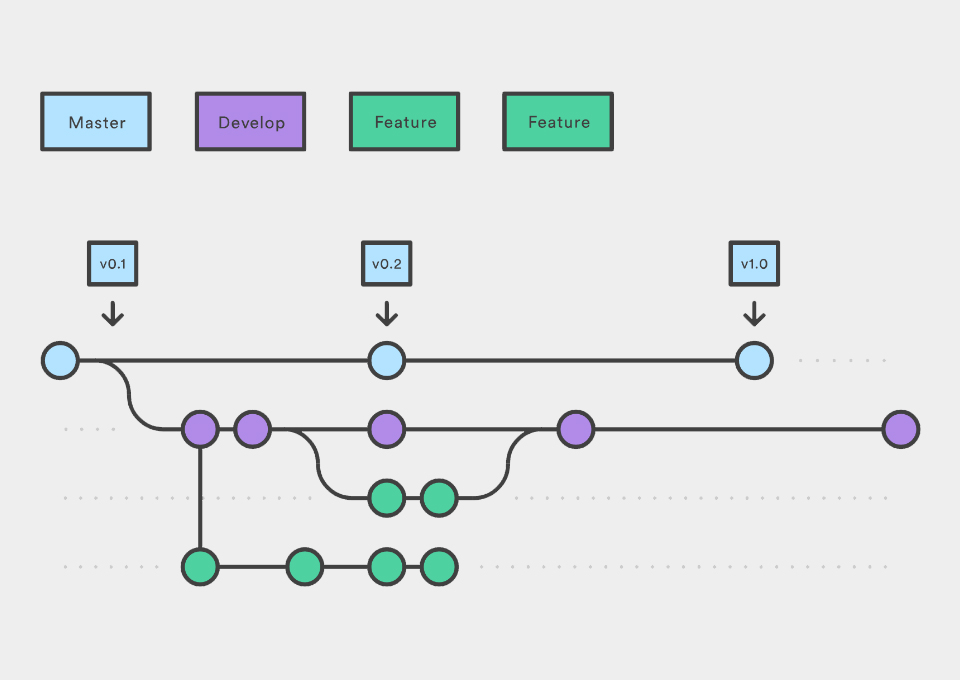

## Тема:
### Мини-игры для развития определенных навыков в программировании
>  Описание:
>
>  Гонки на регулярках.
>  Микросервисы бла-бла lorem text...

## GitFlow:
- В ветке `master` проект готовый к релизу
- В `develop` ведем разработку и вмерживаем ветки фич
- Под каждый сервис своя ветка
(директория сервиса располагается в корневом каталоге проекта)


  И не забывайте, 1 готовый блок кода (фича) = 1 коммит.


## Setup:
- `git clone https://github.com/codequest-team/codequest.git`
- `cd codequest`
- In the root of the project create `.env` file (and substitute your values if necessary):
  ```
  echo 'JWT_SECRET_KEY="e7c83a28f8b8d597afedf2134979ed8ae9f472d1"' > .env
  ```
- `docker-compose up --build`
