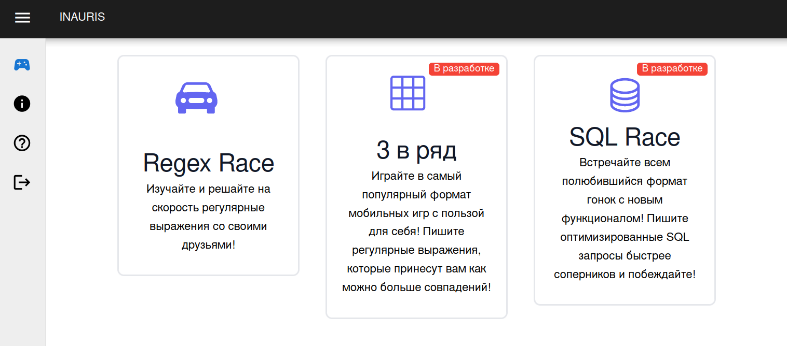
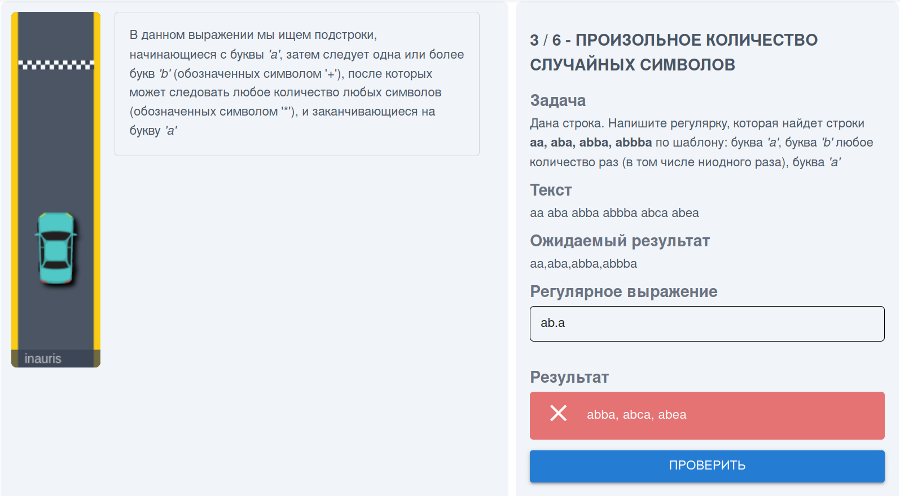
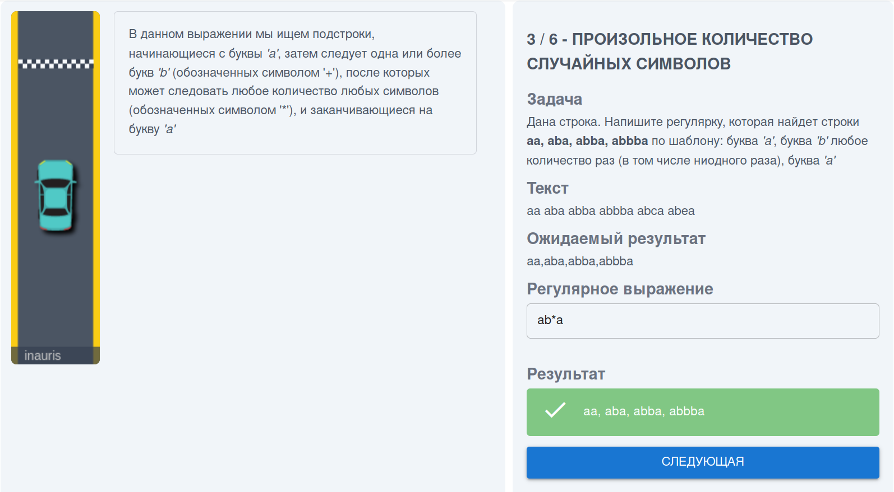
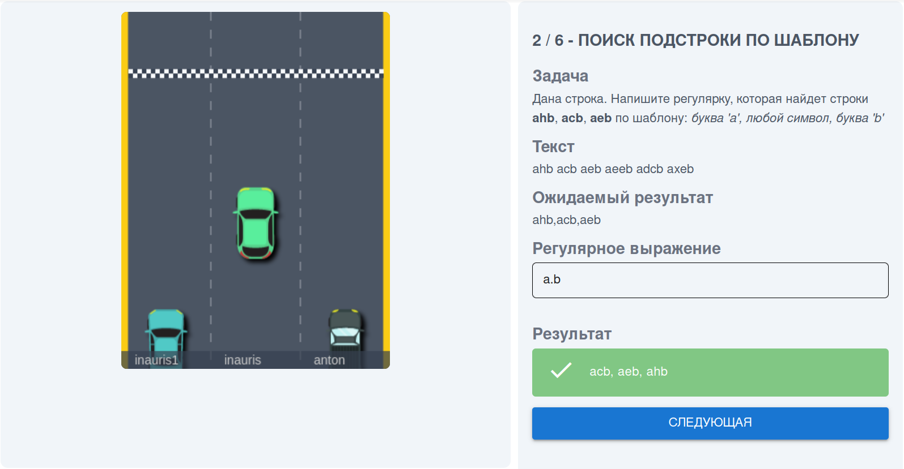

# CodeQuest
> Проект реализован в рамках development hackathon.<br>
> Тема: Мини-игры для развития определенных навыков в программировании

> Авторы: [Дюсенов Асет](https://dyussenov.dev/), [Ким Максим](https://github.com/exynil), [Песков Сергей](https://peskov.dev/)

CodeQuest - игровая платформа представляющая коллекцию игр для разивтия определенных
скиллов в программировании. В качестве mvp представленна игра: **Гонки на регулярках**



## RegexRace
Регулярки в языках программирования это очень мощный инструмент,
но к сожалению у многих он хромает.

**RegexRace** имеет 2 режима:
1) Обучающий режим. Блок с теорией позволяющий подятнуть базу по регуляркам


2) Рейтинговый режим - позволяет пользователям соревноваться в написании регулярок на перегонки.


# Setup:
- `git clone https://github.com/codequest-team/codequest.git`
- `cd codequest`
- copy .envs and substitute your values if necessary:
  ```bash
  cp -r .envs_example .envs
  ```
- generate docker-compose with `docker-compose.sh` (param `dev` for local lauch)
  ```bash
  ./docker-compose.sh dev
  ```
  or
  ```bash
  ./docker-compose.sh prod
  ```
- run project
  ```bash
  docker-compose up --build
  ```
